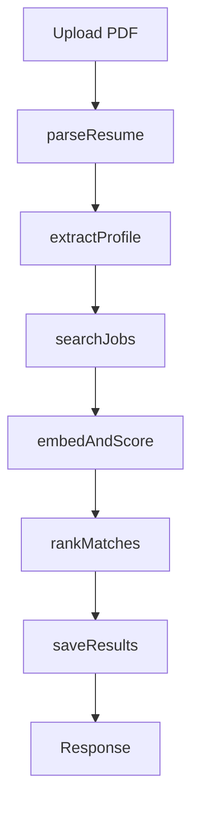

# Resume Job Matcher

An AI-powered full-stack application that takes a PDF resume, understands it, finds real job listings, and returns them ranked by how well they fit the candidate.

Built as a portfolio project to practice **TypeScript**, **LangGraph.js** pipelines, **React** (with a Neo-Brutalism design system), **embeddings**, and **relational database design**.

---

## Table of Contents

- [What It Does](#what-it-does)
- [Tech Stack](#tech-stack)
- [Project Structure](#project-structure)
- [Backend Pipeline](#backend-pipeline)
- [Frontend Architecture](#frontend-architecture)
- [Getting Started](#getting-started)
- [Environment Variables](#environment-variables)
- [Database Schema](#database-schema)
- [Key Design Decisions](#key-design-decisions)
- [Known Limitations](#known-limitations)
- [Author](#author)

---

## What It Does

1. A logged-in user uploads a resume as a PDF via the React frontend.
2. The backend converts the PDF to plain text.
3. An LLM (Groq) pulls out the candidate's skills, work history, target role, and preferred location.
4. The backend searches live job listings through the JSearch API (RapidAPI).
5. The resume and every job are turned into embeddings (Mistral) and compared with cosine similarity.
6. A second LLM (via OpenRouter) re-scores each job for role, experience, and location fit, and writes a short reason for each score.
7. The search and its ranked jobs are saved to PostgreSQL, so the user can view their history later on the dashboard.
8. The frontend displays the results with smooth animations and a premium Neo-Brutalist UI that supports both light and dark modes.

---

## Tech Stack

### Frontend
- **Framework**: React 19 + Vite
- **Styling**: Tailwind CSS (custom Neo-Brutalist design system)
- **State Management**: Zustand (global) + React Query (server state)
- **Routing**: React Router v7
- **Forms & Validation**: React Hook Form + Zod
- **Animations & 3D**: Framer Motion + Three.js (@react-three/fiber)
- **Icons**: Lucide React

### Backend
- **Runtime**: Node.js (ES modules) + TypeScript
- **Framework**: Express 5
- **Pipeline Orchestration**: LangGraph.js
- **Extraction LLM**: Groq (`openai/gpt-oss-120b`)
- **Ranking LLM**: OpenRouter (`google/gemma-4-26b-a4b-it`)
- **Embeddings**: Mistral (`mistral-embed`)
- **Vector Database**: Pinecone (index `resume-job-matcher`)
- **Job Data**: JSearch API via RapidAPI
- **Database**: PostgreSQL (Neon) with `pg` & `node-pg-migrate`
- **Cache & Rate Limiting**: Redis (`ioredis`)
- **Auth**: JWT access + refresh tokens, bcrypt
- **File Upload & PDF Parsing**: Multer + `@cedrugs/pdf-parse`

---

## Project Structure

```text
resume-job-matcher-backend/
├── README.md
├── backend/                       # Node.js Express Backend
│   ├── migrations/                # SQL migrations (users, job_searches, ranked_jobs)
│   └── src/
│       ├── config/                # Env validation, Postgres pool, Redis, Pinecone
│       ├── routes/                # API route definitions
│       ├── controllers/           # Route logic (Auth, Job Match)
│       ├── middlewares/           # JWT auth, Multer upload, error handling
│       ├── graph/                 # LangGraph state + graph definition
│       ├── nodes/                 # The six pipeline nodes for LangGraph
│       ├── services/              # JSearch, embeddings, Pinecone, PDF parsing
│       └── ...
└── frontend/                      # React Vite Frontend
    ├── src/
    │   ├── components/            # Reusable UI components (Neo-Brutalist design)
    │   ├── hooks/                 # Custom React hooks
    │   ├── lib/                   # Utility functions, API client setup (Axios)
    │   ├── pages/                 # Route components (Home, Login, Register, Dashboard, History)
    │   ├── store/                 # Zustand store definitions
    │   ├── types/                 # TypeScript interfaces
    │   └── index.css              # Global styles & CSS variables for light/dark mode
    ├── tailwind.config.js         # Tailwind configuration & custom colors
    └── ...
```

---

## Backend Pipeline

The pipeline is a **LangGraph.js** graph with six nodes that run one after another.



- **parseResume**: Extracts text from the uploaded PDF.
- **extractProfile**: Groq model parses candidate skills, role, and calculates experience.
- **searchJobs**: Queries JSearch API based on the extracted profile.
- **embedAndScore**: Embeds profile and jobs with Mistral, then computes cosine similarity.
- **rankMatches**: OpenRouter LLM re-scores each job based on multiple factors.
- **saveResults**: Saves the complete search and ranking to PostgreSQL.

---

## Frontend Architecture

The frontend is built with a **Neo-Brutalist** aesthetic, focusing on high contrast, stark borders, and bold typography.

- **Theming**: Fully supports Light and Dark modes. The theme is managed via CSS variables in `index.css` and applied through a global context.
- **UI Components**: Custom-built UI components (Buttons, Inputs, Cards) that adhere strictly to the Neo-Brutalism design system without relying on generic component libraries.
- **Data Fetching**: `React Query` handles all API requests (auth, history, uploading resumes), providing caching, loading states, and error handling out of the box.
- **Global State**: `Zustand` is used for lightweight global state management, such as storing user authentication status and theme preferences.
- **3D Elements**: The landing page features an interactive 3D particle simulation built with `Three.js` and `@react-three/fiber` for a premium user experience.

---

## Getting Started

### Prerequisites

- **Node.js 22.18 or newer.**
- **PostgreSQL**: A free Neon database works perfectly.
- **Redis**: For rate limiting and refresh tokens.
- **Pinecone**: Create an index named `resume-job-matcher`, dimension `1024`, metric `cosine`.
- API keys for **Groq**, **OpenRouter**, **Mistral**, and **RapidAPI** (JSearch).

### Setup Backend

```bash
cd backend
npm install
cp .env.example .env
# Fill in your .env values
mkdir uploads

# Run migrations
npx dotenv -e .env -- npx node-pg-migrate up --database-url-var DATABASE_URL

# Start server
npm run dev
```

### Setup Frontend

```bash
cd frontend
npm install
cp .env.example .env
# Fill in your frontend .env (e.g., VITE_API_URL=http://localhost:4000/api)

# Start dev server
npm run dev
```

The app will be available at `http://localhost:5173`.

---

## Environment Variables

### Backend (`backend/.env`)
Required variables: `PORT`, `NODE_ENV`, `DATABASE_URL`, `REDIS_HOST`, `REDIS_PORT`, `REDIS_PASSWORD`, `ACCESS_TOKEN_SECRET`, `REFRESH_TOKEN_SECRET`, `GROQ_API_KEY`, `OPENROUTER_API_KEY`, `MISTRAL_API_KEY`, `PINECONE_API_KEY`, `RAPID_API_KEY_API`.

### Frontend (`frontend/.env`)
Required variables: `VITE_API_URL` (usually `http://localhost:4000/api`).

---

## Database Schema

Three main tables in PostgreSQL:
- **`users`**: User accounts (username, email, hashed password).
- **`job_searches`**: One row per resume upload (includes extracted JSON profile).
- **`ranked_jobs`**: The resulting ranked jobs for a search, linked to `job_searches`.

---

## Key Design Decisions

- **LangGraph for Backend Pipeline**: Makes the complex AI workflow modular, testable, and robust.
- **Neo-Brutalism UI**: Chosen to make the application visually distinct and memorable compared to standard clean corporate UIs.
- **Custom CSS over Utility-Only**: While Tailwind is used extensively, complex layered shadows and specific Neo-Brutalist borders are managed via custom CSS classes (`index.css`) for consistency.
- **Two-Stage Scoring**: Embedding similarity is used as a fast first pass. An LLM then adjusts scores based on role level and experience.

---

## Known Limitations

- **Sequential Pipeline**: The backend process is synchronous and can take up to 30-40 seconds.
- **No Background Queue**: Resume processing happens in the HTTP request lifecycle.
- **Limited Job Sources**: Currently relies only on the JSearch API, restricted to India (`in`).

---

## Author

**Habeeb Ashraf**  
GitHub: [@habeebashraf136](https://github.com/habeebashraf136)